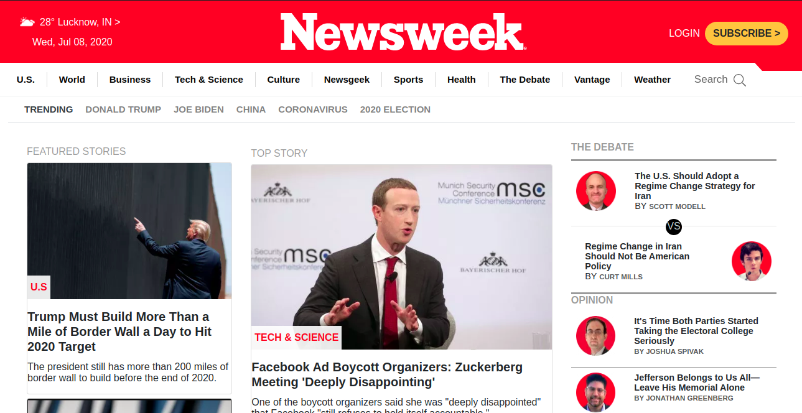
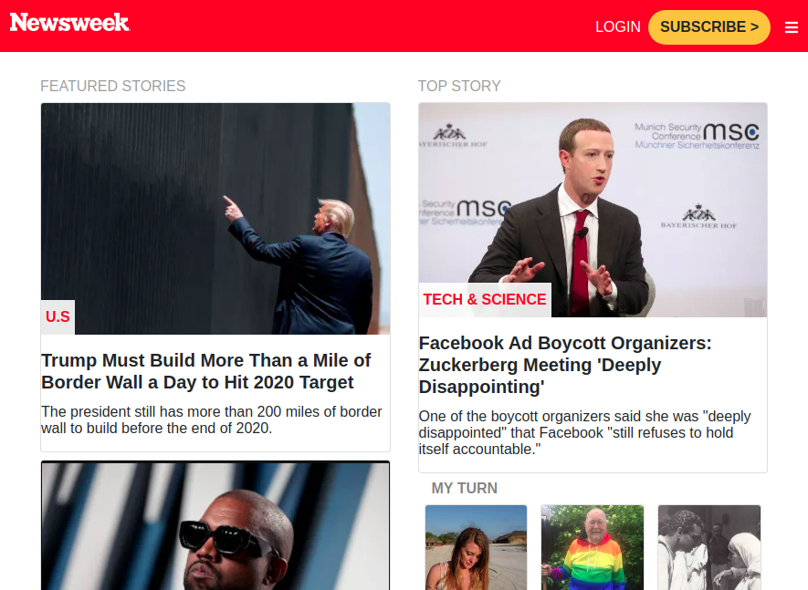
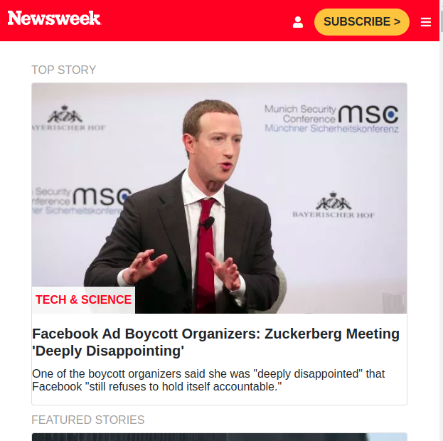

# Clone of website newsweek.com Using Bootstrap

> 
This project is focused on creating responsive homepage of the news site Newsweek.com using the Bootstrap framework. In this project we're required to create homepage of [Newsweek](https://www.newsweek.com/)

In this task we were required to create a responsive homepage clone of Newsweek using the best practices of HTML AND CSS with GitHub process flow.

## Desktop Screenshot

## Small screen Screenshot

## Mobile Device Screenshot

## Built With

- Twitter’s Bootstrap framework
- HTML
- CSS

## Live Demo

[Live Demo Link](https://raw.githack.com/Rocio01/Using-Bootstrap/master/index.html)

### Prerequisites

- Browser (Google Chrome, Mozilla Firefox, Safari or any other browser)

### Setup

- Download or clone the repository's files
- Open the index.html file using any web browser of your choice
- Additionally, You can go to [githack](https://raw.githack.com) and put the link of HTML file there and access the site from generated link.

## Author

👤 **Rocio Martinez**

- Github: [@Rocio01](https://github.com/Rocio01)
- Twitter: [@rugiada8801](https://twitter.com/rugiada8801)
- Linkedin: [zulma-rocio-martinez](https://www.linkedin.com/in/zulma-rocio-martinez/)

👤 **Prabhakar Pandey**

- Github: [@Prabhakarzx](https://github.com/Prabhakarzx)
- Twitter: [@Prabhakarzx](https://twitter.com/prabhakarzx)
- Linkedin: [@Prabhakarzx](https://www.linkedin.com/in/prabhakarzx/)

## 🤝 Contributing

Contributions, issues and feature requests are welcome!

Feel free to check the [issues page](https://github.com/Rocio01/Using-Bootstrap/issues).

## Show your support

Give a ⭐️ if you like this project!

## Acknowledgments

- Microverse
- GitHub
- TheOdinProject
- Bootstrap

## 📝 License

This project is [MIT](lic.url) licensed.
